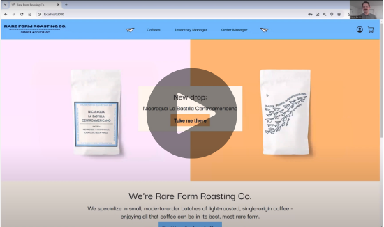

*Rare Form Roasting Co.* is a proof-of-concept e-commerce website for my personal coffee roasting company. 

## Tech Stack
- Front-end: React.js, styled with some heavily-modified [Reactstrap](https://github.com/reactstrap/reactstrap)
- APIs & database interfacing: C#/.NET (ASP.NET Core), Entity Framework Core
- Database: PostgreSQL

Developed using VSCode, GitHub, Create React App, and Postman API.

## Demonstration

View a quick demonstration of *Rare Form Roasting Co.* here:

## Some techy things I like:
- Custom-built backend with ASP.NET Core MVC controllers for API endpoints, securely connected to a PostgreSQL database for persistent storage
- UI login functionality integrated via ASP.NET Core Identity, with different views and privileges available depending on the logged-in user's role
- Full CRUD operations on multiple fronts: customer users can customize and place orders, admin users can manage orders and inventory
- Development managed using agile methodology; created an ERD, wireframe, and user stories; planned sprints; managed tasks via GitHub Issue Tracker & Projects tool
- A well-thought-through UI and vibe: friendly for multiple viewports; custom graphic design and branding

## Wireframe

## ERD
